# Ablation Study: Scoring Component Impact

## Overview
This study analyzes the contribution of each scoring component to the final **ATS Score** and **JobFit Score**. By "ablating" (removing) one component at a time (setting its weight to 0), we measure its impact on the total score.

**Baseline Scores:**
- **ATS Score:** 27.5 / 100
- **JobFit Score:** 46.2 / 100

> **Note:** A large "Score Drop" indicates that the component was a strong contributor to the total score. A drop of 0.0 means the component was contributing 0 points (i.e., the sub-score for that component was 0).

---

## 1. ATS Score Ablation
**Full Score: 27.5**

| Component Removed | Score w/o Component | **Score Drop (Impact)** | Weight |
| :--- | :--- | :--- | :--- |
| **Section Distribution** | 17.9 | **-9.7** 🟥🟥🟥🟥🟥 | 10% |
| **Lexical Coverage** | 19.3 | **-8.2** 🟥🟥🟥🟥 | 30% |
| **TF-IDF Relevance** | 20.3 | **-7.2** 🟥🟥🟥🟨 | 25% |
| **TF-IDF Cosine** | 25.7 | **-1.8** 🟨 | 20% |
| **Fuzzy Coverage** | 26.9 | **-0.6** ⬜ | 15% |

### Analysis
- **Section Distribution (Delta -9.7)**: This was the highest contributor despite a low weight (10%). This implies the **Section Distribution Score was nearly perfect (~97/100)**. The CV has excellent keyword placement structure.
- **Lexical Coverage (Delta -8.2)**: Adjusted for its 30% weight, the actual component score was low (~27/100). Matches are present but sparse.
- **Fuzzy Coverage (Delta -0.6)**: Almost negligible. The system found very few "near matches" that weren't exact matches.

---

## 2. JobFit Score Ablation
**Full Score: 46.2**

| Component Removed | Score w/o Component | **Score Drop (Impact)** | Weight |
| :--- | :--- | :--- | :--- |
| **Experience Alignment** | 19.1 | **-27.2** 🟥🟥🟥🟥🟥🟥🟥🟥🟥🟥🟥🟥🟥 | 35% |
| **Summary Similarity** | 33.8 | **-12.5** 🟥🟥🟥🟥🟥🟥 | 20% |
| **Domain Relevance** | 39.7 | **-6.6** 🟥🟥🟥 | 10% |
| **Skills Alignment** | 46.2 | **0.0** ⬜ | 25% |
| **Education Match** | 46.2 | **0.0** ⬜ | 10% |

### Analysis
- **Experience Alignment (Delta -27.2)**: The dominant driver. The semantic match between the CV's bullets and the JD's responsibilities is carrying the score.
- **Summary Similarity (Delta -12.5)**: Strong contribution. The CV's summary aligns reasonably well with the role summary.
- **Skills & Education (Delta 0.0)**: **Critical Failure**. These components contributed **zero points**.
  - **Skills:** The JD asks for "Math, Tutoring" while the CV lists "Python, Data Science". Zero overlap.
  - **Education:** Likely a mismatch in degree extraction or requirements (e.g., CV missing specific "Bachelor's" phrasing or JD requirement parsing issue).

---

## Visual Summary

```mermaid
%%{init: {'theme': 'base', 'themeVariables': { 'git0': '#ff0000', 'git1': '#00ff00' } } }%%
gantt
    title Component Contribution to Total Score
    dateFormat X
    axisFormat %s

    section ATS Score (27.5)
    Section Distribution (9.7) :done, a1, 0, 9.7
    Lexical Coverage (8.2)     :done, a2, 0, 8.2
    TF-IDF Relevance (7.2)     :done, a3, 0, 7.2
    TF-IDF Cosine (1.8)        :active, a4, 0, 1.8
    Fuzzy Coverage (0.6)       :active, a5, 0, 0.6

    section JobFit Score (46.2)
    Experience Alignment (27.2):crit, j1, 0, 27.2
    Summary Similarity (12.5)  :crit, j2, 0, 12.5
    Domain Relevance (6.6)     :active, j3, 0, 6.6
    Skills Alignment (0.0)     :j4, 0, 0
    Education Match (0.0)      :j5, 0, 0
```

*(Length of bar represents points contributed to the final score)*
