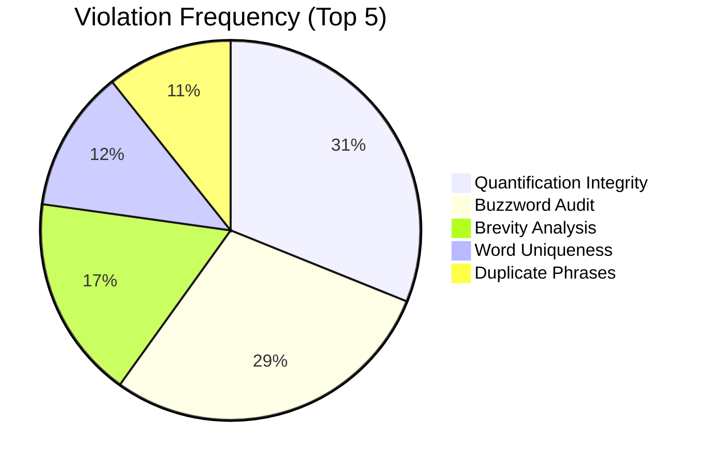
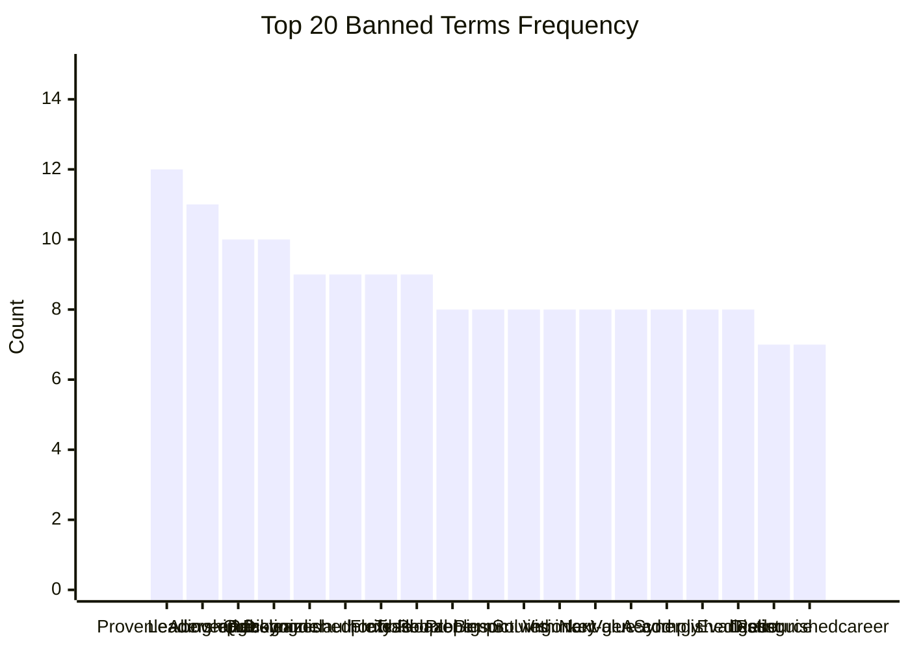

# Compliance Audit Distribution Report

## Overview
This report analyzes the results of a large-scale compliance audit performed on **500 CVs** across various domains and seniority levels. The audit checks for adherence to 7 strict ATS compliance rules.

**Total Samples:** 500
**Overall Pass Rate:** ~2.8% (Strict Compliance)

---

## 1. Violation Frequency by Rule
**Insight:** The most common failure point is **Quantification Integrity** (72% failure rate), followed closely by **Buzzword Breaches** (67%). Most candidates fail to quantify their achievements or rely on generic jargon.

---

## 2. Top 20 Violated Buzzwords
**Insight:** Candidates frequently rely on subjective self-descriptors like "Proven leadership" and "Visionary" instead of objective evidence.

---

## 3. Pass-Rate by Domain & Role Level
**Insight:** Pass rates are exceptionally low across all cohorts, indicating that strict ATS compliance (e.g., zero buzzwords, 100% quantified bullets) is rarely achieved naturally.
- **Entry Level:** Higher pass rates in Engineering (likely due to fewer buzzwords), but still low.
- **Executive Level:** **0% Pass Rate** across almost all domains, primarily due to high Buzzword usage and Brevity violations.

```mermaid
gantt
    title Pass Rate % by Domain (Mid-Level vs Senior)
    dateFormat X
    axisFormat %s

    section Engineering
    Mid-Level (5.3%) :done, e1, 0, 5.3
    Senior (10.0%)    :active, e2, 0, 10.0

    section Marketing
    Mid-Level (10.5%) :done, m1, 0, 10.5
    Senior (3.7%)     :active, m2, 0, 3.7

    section Product
    Mid-Level (0.0%)  :done, p1, 0, 0
    Senior (3.8%)     :active, p2, 0, 3.8
```

## Detailed Findings

### A. The "Quantification Failure"
The audit reveals that **72% of candidates** fail the **Quantification Integrity** check.
- **Rule:** Every experience bullet must contain a metric (%, $, #).
- **Reality:** Most bullets describe responsibilities (e.g., "Managed team") rather than outcomes (e.g., "Managed team of 10").

### B. The "Executive Buzzword Trap"
Executives showed the lowest pass rates.
- **Cause:** Over-reliance on "Strategy", "Visionary", "Synergy", and "Transformational".
- **Impact:** While these terms are common in executive summaries, strict ATS parsers flag them as "fluff" if not supported by data.

### C. Unique Word Count & Brevity
- **40% of CVs** failed the Brevity check (usually too long or too short).
- **28% of CVs** failed Repetitive Phrase checks, indicating a tendency to copy-paste job descriptions or reuse phrases like "Responsible for".
