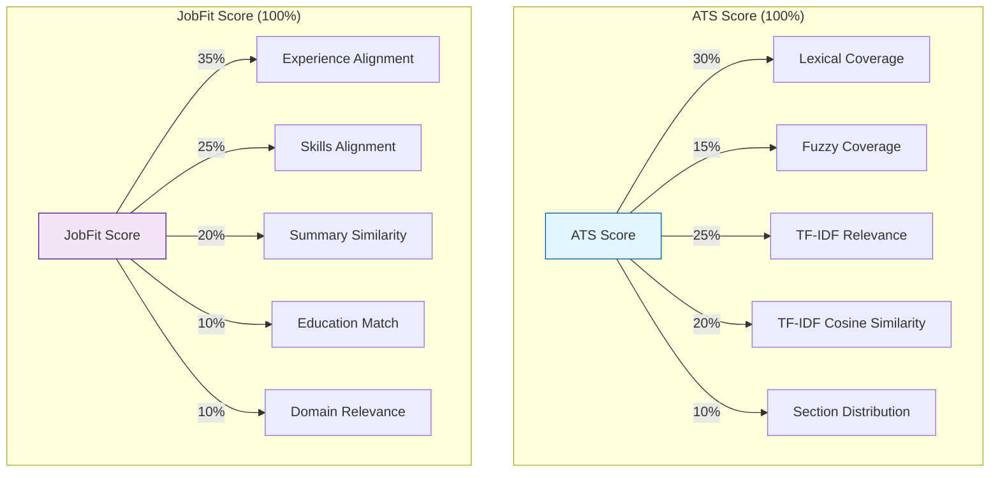

# Scoring Breakdown Diagram (ATS & JobFit)

This document details the components, weights, and logic used in the ATS and JobFit scoring algorithms.

## Overview Diagram

---

## 1. ATS Score Components

The ATS Score measures the "parseability" and keyword presence of the CV relative to the Job Description (JD). It mimics how an Applicant Tracking System filters candidates.

| Component | Weight | Description | Logic |
| :--- | :--- | :--- | :--- |
| **Lexical Coverage** | **30%** | Exact keyword matching. | `Matches / Total JD Keywords`. Measures simple keyword recall. |
| **TF-IDF Relevance** | **25%** | Contextual keyword importance. | Weighted sum of matched keywords based on TF-IDF weights. Rare, important keywords count more. |
| **TF-IDF Cosine Similarity** | **20%** | Overall document similarity. | Cosine similarity between the TF-IDF vector of the entire CV and the JD. Captures global context match. |
| **Fuzzy Coverage** | **15%** | Near-matches (typos, variations). | Matches keywords with slight spelling variations (Levenshtein distance) that were missed by exact match. |
| **Section Distribution** | **10%** | Structural placement quality. | Entropy of matched keywords across `Summary`, `Skills`, and `Experience`. High score means keywords are well-distributed, not just keyword stuffed in one place. |

---

## 2. Job Fit Score Components

The JobFit Score measures the qualitative alignment of the candidate's profile with the specific role requirements, going beyond simple keyword matching.

| Component | Weight | Description | Logic |
| :--- | :--- | :--- | :--- |
| **Experience Alignment** | **35%** | Semantic match of work history. | Average max similarity between CV experience *bullet points* and JD *key responsibilities*. Uses semantic embeddings (Sentence-BERT). |
| **Skills Alignment** | **25%** | Hard & soft skills match. | Weighted combination: **70% Required Skills** + **30% Preferred Skills**. |
| **Summary Similarity** | **20%** | High-level profile match. | Cosine similarity between the **CV Summary** and the **JD Role Summary**. Ensures the candidate's core narrative matches the role. |
| **Education Match** | **10%** | Credential qualification. | Explicit check of **Degree Level** (e.g., Bachelor's, Master's). Scores: 1.0 (Meets/Exceeds), 0.75 (Meets Preferred), 0.5 (One level below), 0.0 (Fail). |
| **Domain Relevance** | **10%** | Industry-specific fit. | Semantic similarity between the *aggregated* CV experience bullets and specific **JD Domain Keywords**. |

## Key Technical Notes

- **Embeddings**: Uses `sentence-transformers/all-MiniLM-L6-v2` for semantic comparisons (Summary, Experience, Domain).
- **Normalization**: Both scores and all components are normalized to a **0-100** scale.
- **Thresholds**:
  - **Poor**: 0-50
  - **Medium**: 50-75
  - **Strong**: 75-90
  - **Excellent**: 90-100
